# Cash Compass – Expense Tracker App


**Cash Compass** is a comprehensive **expense tracker and budget management app** that helps you manage your finances with ease. Track your income, expenses, and transfers, visualize your spending patterns, and plan your budget effectively. The app is compatible with **light and dark mode** and supports **multi-currency management**.

---

## Features

### 1. Authentication

* **Login Screen:** Securely log into your account.
* **Register Screen:** Create a new account with email/password.

**Screenshots:**

* Login: 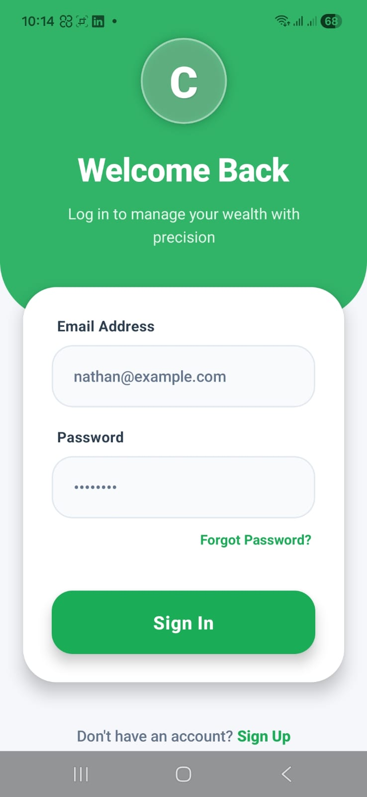
* Register: 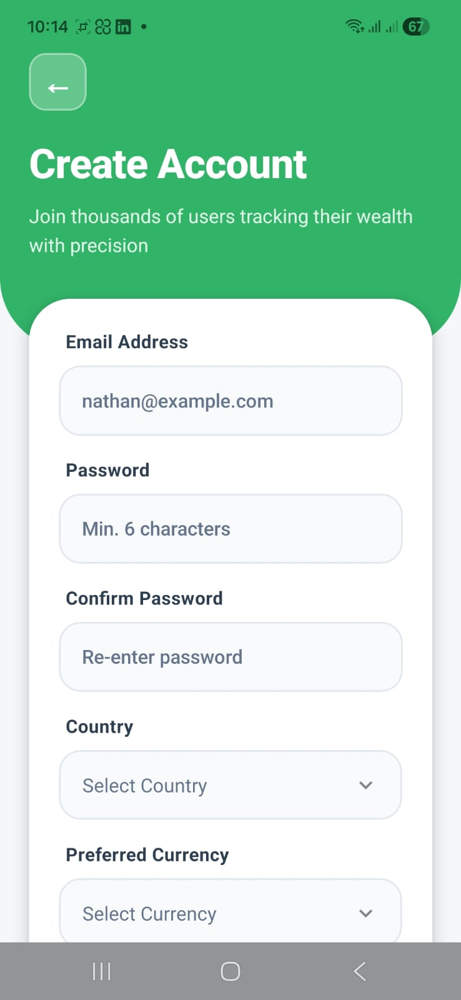

---

### 2. Dashboard / Home Screen

* View **Total Balance, Income, and Expenses**.
* Supports **Daily, Weekly, Monthly, and Yearly** overview.
* Displays **recent transactions**.
* Interactive **analytics charts** for better insights.
* Quick access to **Add Transaction, Budget Planner, and Settings**.

**Screenshot:**
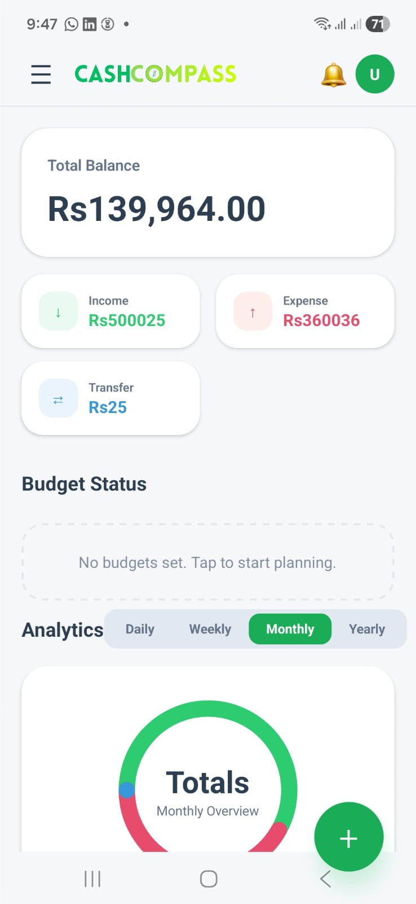

---

### 3. Add Transaction

* Record **Expenses, Income, or Transfer**.
* Set **categories, amounts, dates**, and **notes**.
* Easy and fast transaction entry for better tracking.

**Screenshots:**

* Add Expense: 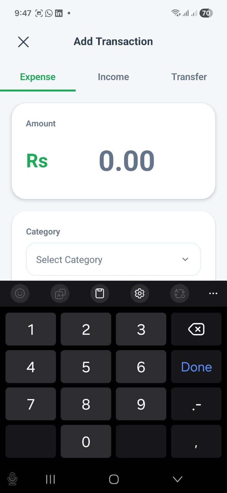


---

### 4. Budget Planner

* Manage your **budget goals** for different categories.
* Create **custom plans** with limits for specific periods.
* Monitor **budget progress** and alerts for overspending.

**Screenshots:**

* Budget Planner Overview: 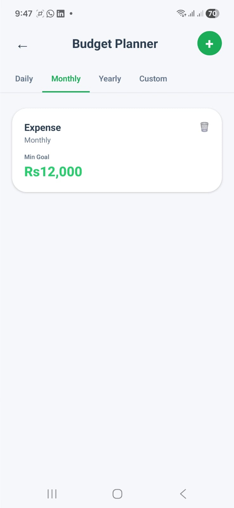
* Create Budget Plan: 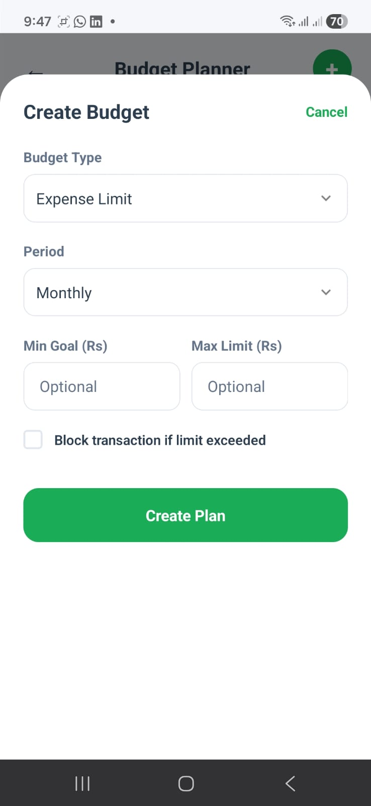

---

### 5. Statistics

* Visualize your **daily, monthly, and yearly spending**.
* Supports **charts and graphs** for clear insights.
* Helps identify **spending patterns and trends**.

**Screenshot:**
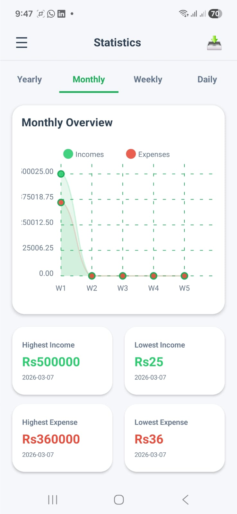

---

### 6. Profile & Settings

* Edit personal details and profile picture.
* Manage **notifications, currency, and app preferences**.
* Toggle **Dark/Light Mode** for personalized experience.

**Screenshots:**

* Settings Screen: 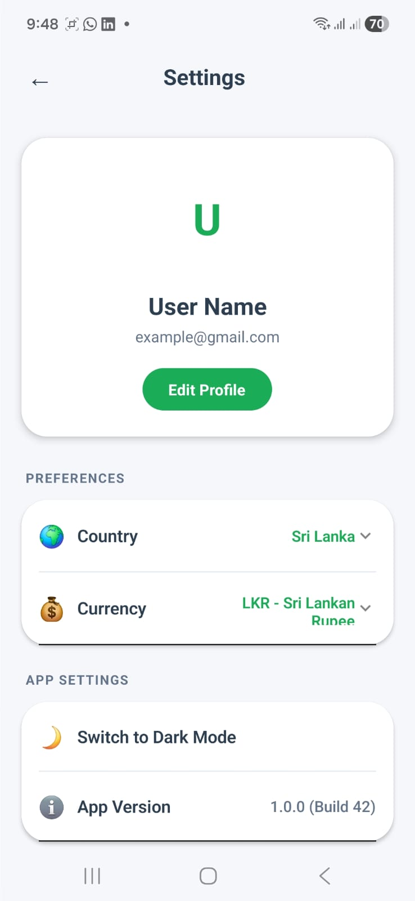
* Edit Profile: 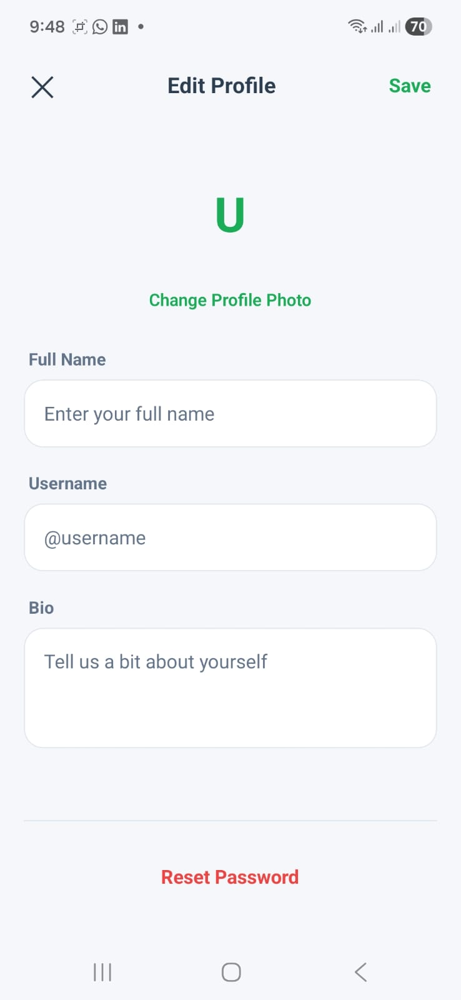

---

### 7. Transaction Records & Filtering

* View all past transactions in one place.
* Apply **advanced filters**: date range, category, type (income/expense/transfer).
* Export reports for offline tracking.

**Screenshot:**
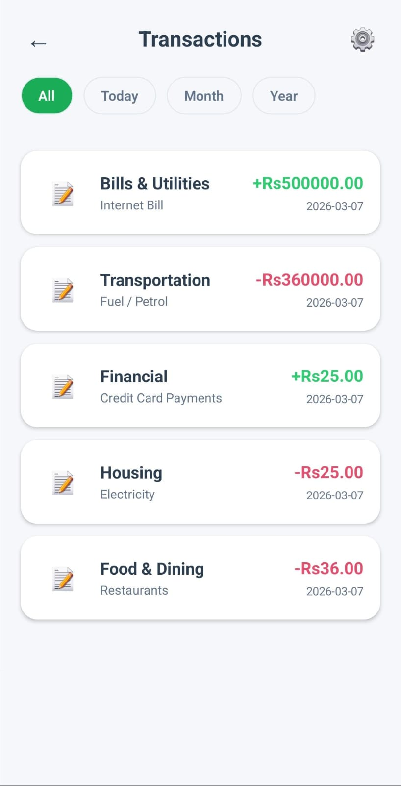

---

### 8. Dark Mode

* Seamless **dark mode** support across the app.
* Optimized for **battery saving and night usage**.

**Screenshots:**

* Dark Mode Example 1: 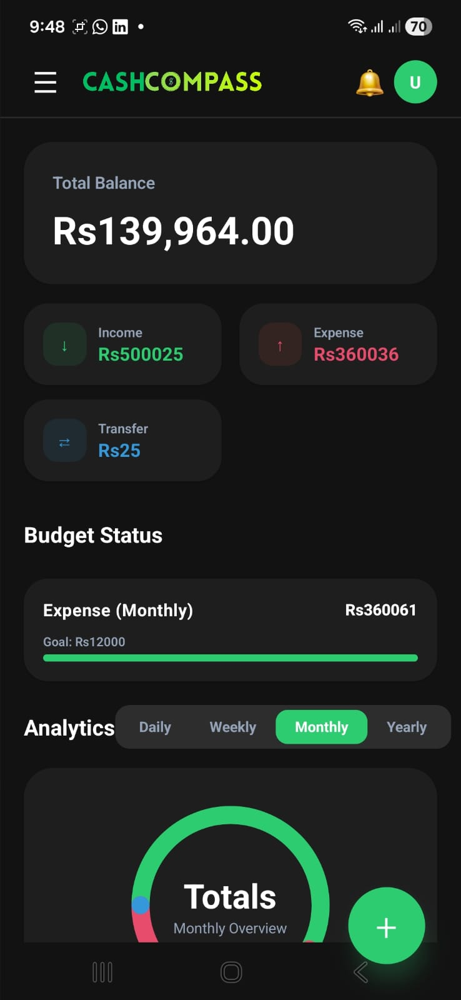
* Dark Mode Example 2: 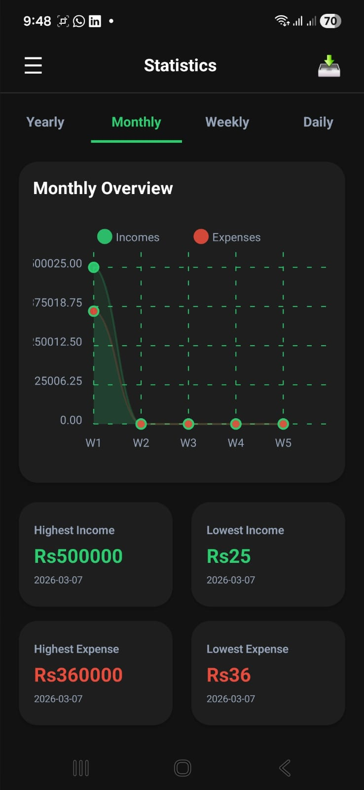
* Dark Mode Example 3: 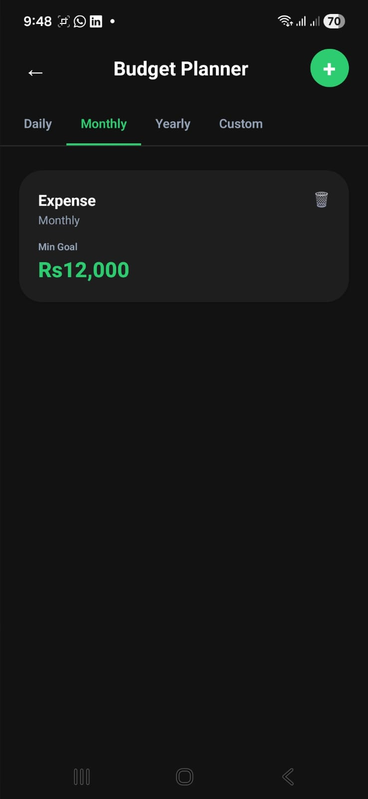

---

## Other Features

* **Download Reports:** Daily, Monthly, and Yearly reports in PDF format.
* **Multi-Currency Support:** Easily switch between currencies.
* **Notifications:** Stay on top of your budgets and upcoming transactions.

---

## Installation

1. **Clone the repository**

```bash
git clone https://github.com/manuka8/CashCompass.git
cd cash-compass
```

2. **Install dependencies**

```bash
npm install
```

3. **Setup Environment Variables**
   Create a `.env` file in the root directory with the following sample:

```env
EXPO_PUBLIC_SUPABASE_URL=
EXPO_PUBLIC_SUPABASE_ANON_KEY=

```

4. **Run the app**


```bash
npx start
```


---

## Screenshots Overview

1. Login Screen
2. Register Screen
3. Home Screen – Dashboard
4. Add Transaction (Expense / Income / Transfer)
5. Budget Planner Overview
6. Create Budget Plan
7. Statistics Screen
8. Settings Screen
9. Edit Profile
10. All Transactions with Filtering
11. Dark Mode Examples

---

## Download App

* **Android APK:** [Download Here](https://expo.dev/artifacts/eas/cxCnPvUwwtGJpw2AjnzHEb.apk)
* **iOS App:** Available soon on App Store

---

## Contributing

We welcome contributions!

1. Fork the repository.
2. Create your branch: `git checkout -b feature-name`.
3. Commit your changes: `git commit -m "Add new feature"`.
4. Push to the branch: `git push origin feature-name`.
5. Create a Pull Request.

---

## License

This project is licensed under the **MIT License** – see the LICENSE file for details.

---

## Contact

For support or feedback:
📧 Email: [manukamayurajith2001@gmail.com](mailto:manukamayurajith2001@gmail.com)

---

If you want, I can **create a fully formatted Markdown README with all 13 screenshots properly numbered and ready to drop in your repo**, so it will look **professional on GitHub**.

Do you want me to do that next?
