# Cash Compass – Expense Tracker App

**Cash Compass** is a comprehensive **expense tracker and budget management app** that helps you manage your finances with ease. Track your income, expenses, and transfers, visualize your spending patterns, and plan your budget effectively. The app is compatible with **light and dark mode** and supports **multi-currency management**.

---

## Features

### 1. Authentication
Securely log into your account or create a new one with email/password.

| Login | Register |
|-------|---------|
| 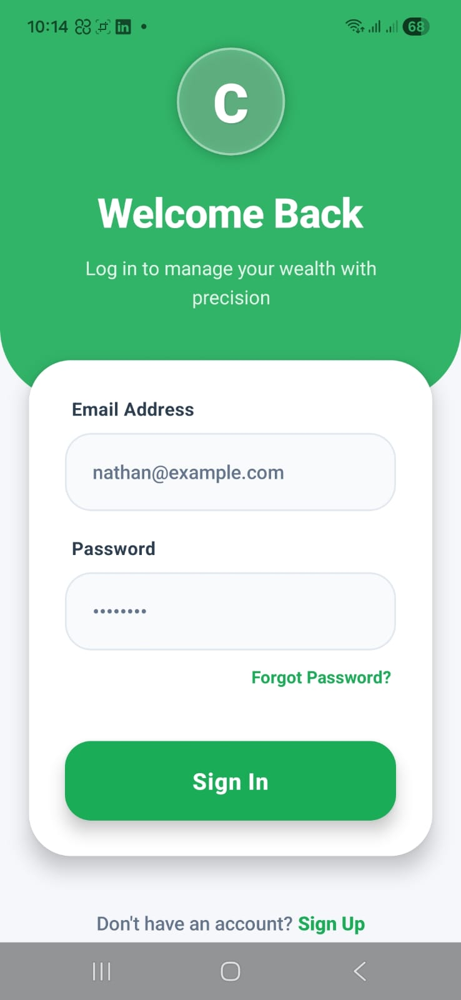 | 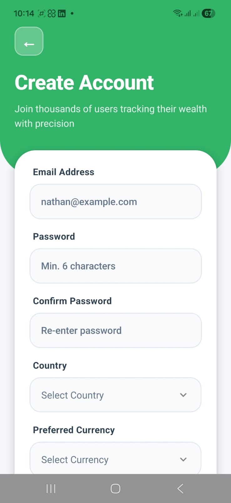 |

---

### 2. Dashboard / Home Screen
- View **Total Balance, Income, and Expenses**
- Supports **Daily, Weekly, Monthly, and Yearly** overview
- Displays **recent transactions**
- Interactive **analytics charts** for better insights
- Quick access to **Add Transaction, Budget Planner, and Settings**

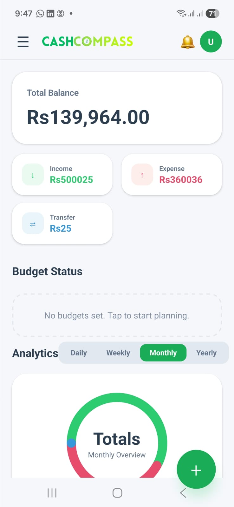

---

### 3. Add Transaction
- Record **Expenses, Income, or Transfer**
- Set **categories, amounts, dates**, and **notes**
- Easy and fast transaction entry for better tracking

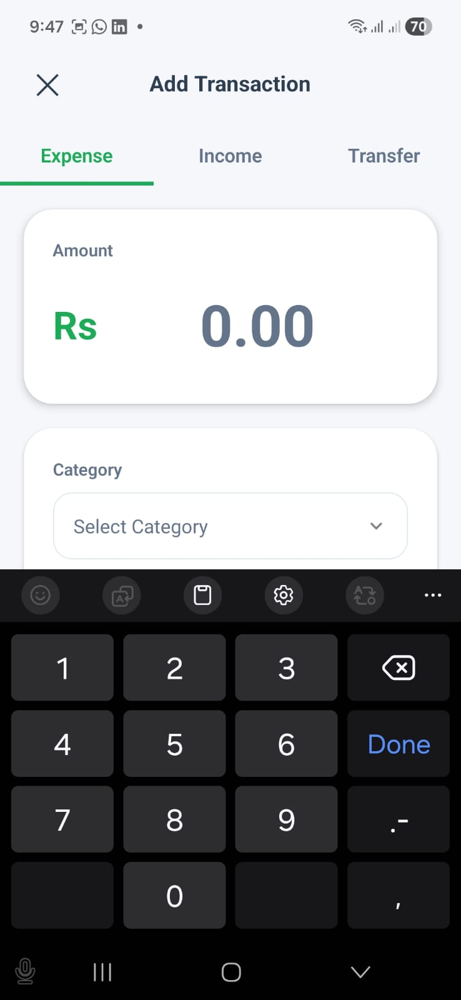

---

### 4. Budget Planner
- Manage your **budget goals** for different categories
- Create **custom plans** with limits for specific periods
- Monitor **budget progress** and alerts for overspending

| Budget Planner Overview | Create Budget Plan |
|------------------------|-------------------|
| 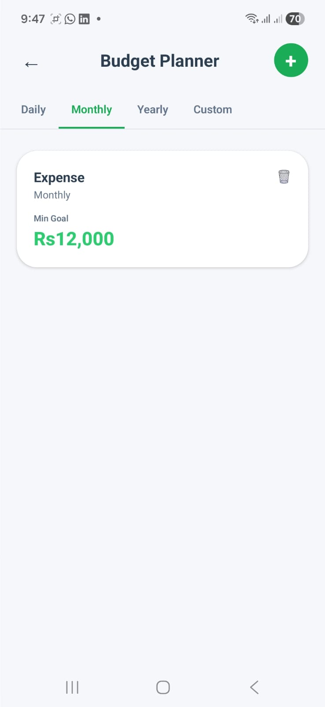 | 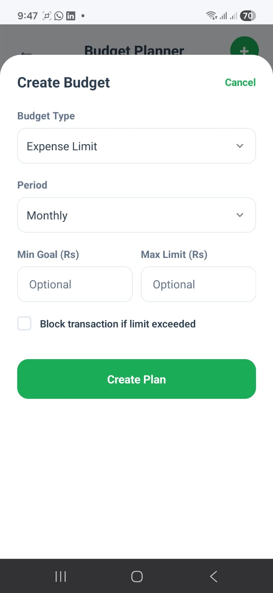 |

---

### 5. Statistics
- Visualize your **daily, monthly, and yearly spending**
- Supports **charts and graphs** for clear insights
- Helps identify **spending patterns and trends**

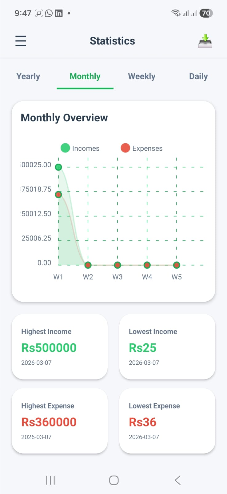

---

### 6. Profile & Settings
- Edit personal details and profile picture
- Manage **notifications, currency, and app preferences**
- Toggle **Dark/Light Mode** for personalized experience

| Settings | Edit Profile |
|----------|-------------|
| 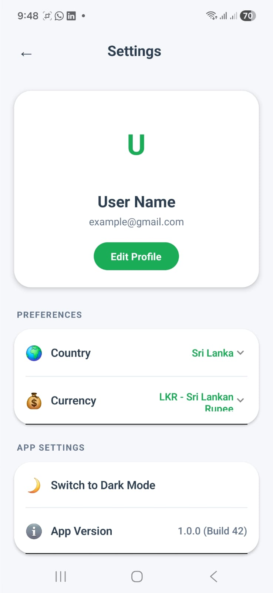 | 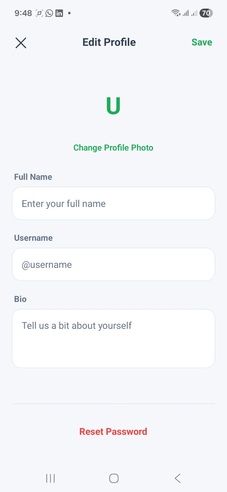 |

---

### 7. Transaction Records & Filtering
- View all past transactions in one place
- Apply **advanced filters**: date range, category, type (income/expense/transfer)
- Export reports for offline tracking

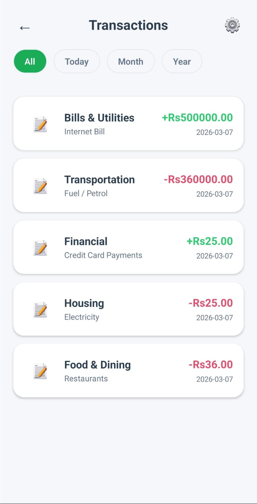

---

### 8. Dark Mode
Seamless **dark mode** support across the app, optimized for **battery saving and night usage**.

| Dark Mode Example 1 | Dark Mode Example 2 | Dark Mode Example 3 |
|--------------------|--------------------|--------------------|
| 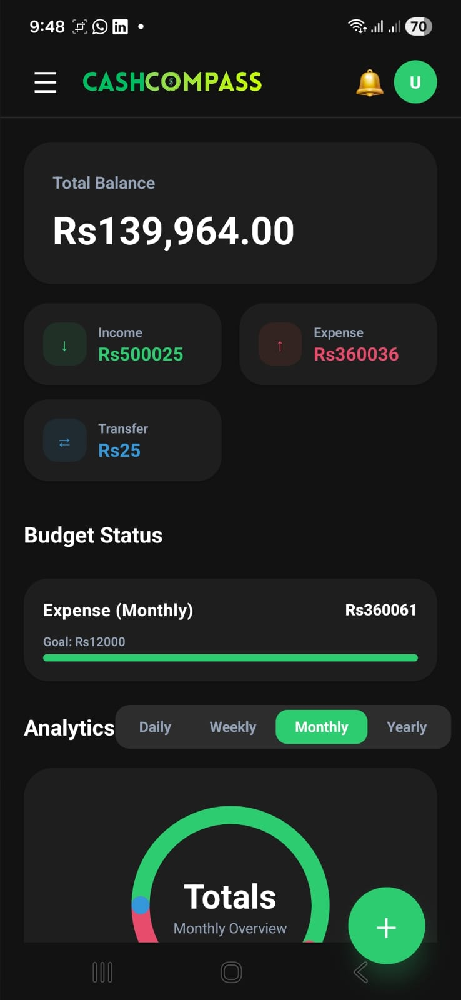 | 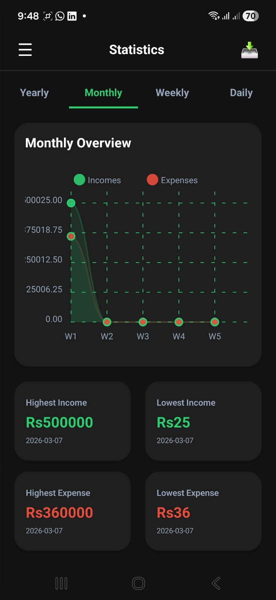 | 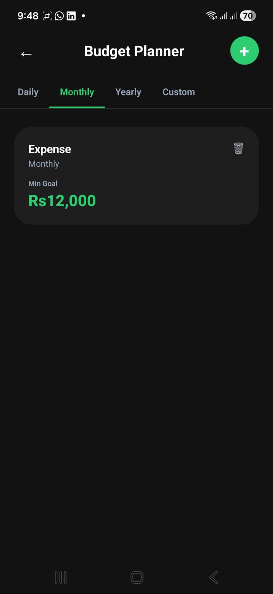 |

---

## Other Features

- **Download Reports:** Daily, Monthly, and Yearly reports in PDF format
- **Multi-Currency Support:** Easily switch between currencies
- **Notifications:** Stay on top of your budgets and upcoming transactions

---

## Installation

### 1. Clone the repository

```bash
git clone https://github.com/manuka8/CashCompass.git
cd CashCompass
```

### 2. Install dependencies

```bash
npm install
```

### 3. Setup Environment Variables
Create a `.env` file in the root directory:

```env
EXPO_PUBLIC_SUPABASE_URL=your_supabase_url_here
EXPO_PUBLIC_SUPABASE_ANON_KEY=your_supabase_anon_key_here
```

### 4. Run the app

```bash
npx expo start
```

---

## Download App

| Platform | Link |
|----------|------|
| **Android APK** | [Download Here](https://expo.dev/artifacts/eas/cxCnPvUwwtGJpw2AjnzHEb.apk) |
| **iOS App** | Available soon on App Store |

---

## Tech Stack

- **Frontend:** React Native / Expo
- **Backend:** Supabase
- **State Management:** React Context / Redux
- **Charts:** React Native Chart Kit
- **PDF Generation:** React Native PDF

---

## Contributing

We welcome contributions!

1. Fork the repository
2. Create your branch: `git checkout -b feature/your-feature-name`
3. Commit your changes: `git commit -m "Add your feature"`
4. Push to the branch: `git push origin feature/your-feature-name`
5. Open a Pull Request

---

## License

This project is licensed under the **MIT License** – see the [LICENSE](LICENSE) file for details.

---

## Contact

For support or feedback:

📧 **Email:** [manukamayurajith2001@gmail.com](mailto:manukamayurajith2001@gmail.com)

🐙 **GitHub:** [manuka8](https://github.com/manuka8)

---

## Show Your Support

If you found this project helpful, please give it a ⭐️ on GitHub!
---
